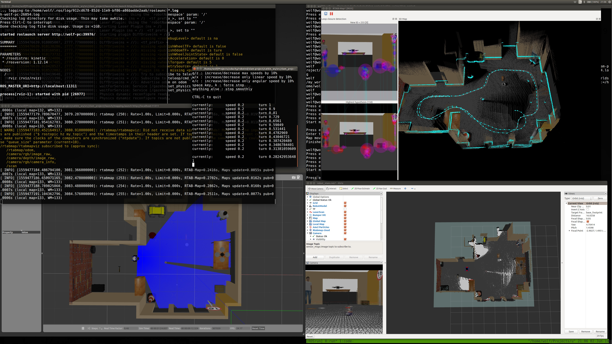

# Project: Map My World Robot

### Information 

The goal of this project is to experiment with SLAM using ROS and Gazebo.
This project is part of the second term of the Robotics Software Engineer Nanodegree from Udacity.

Report can be found .

The tasks include:
* Create a ROS package that is able to launch your robot and have it map the surrounding area.
* Use Debug tools and other checks mentioned in the lessons to verify that your robot is mapping correctly.
* Create a 3D map for the supplied environment.
* Create your own Gazebo world and generate a map for that environments as well.
* Follow the rubric to generate a proper report and determine which files need to be submitted.

### Results
Generated ocupancy grid map has visual similarity with original map. 
Several loop closures are detected when the robot passes the same position. 

### Future activities 
* Test in real robots
* Use 3D sensors and 3D maps
* Experiment with dynamic maps

